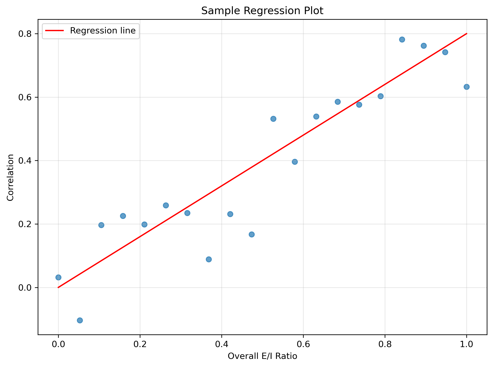
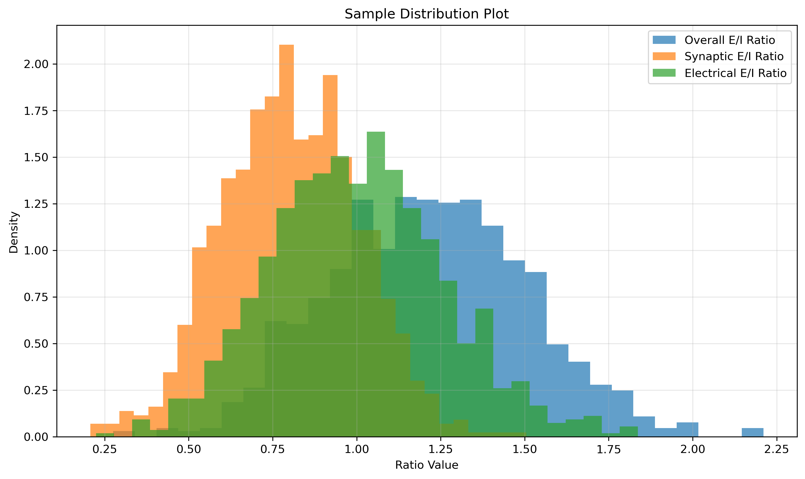
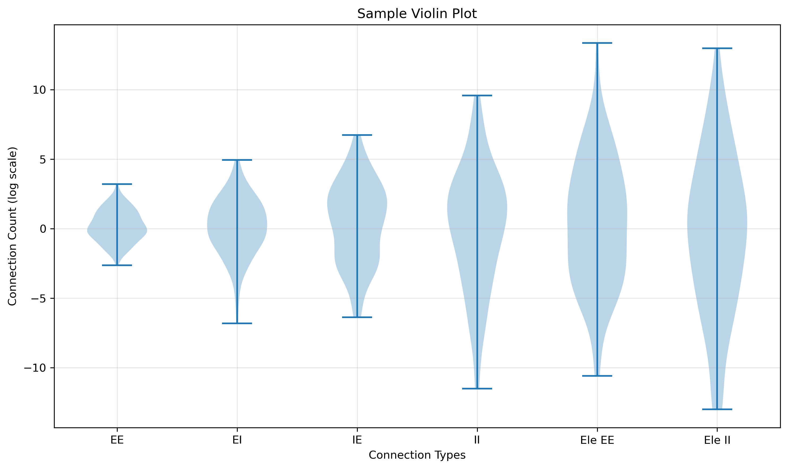
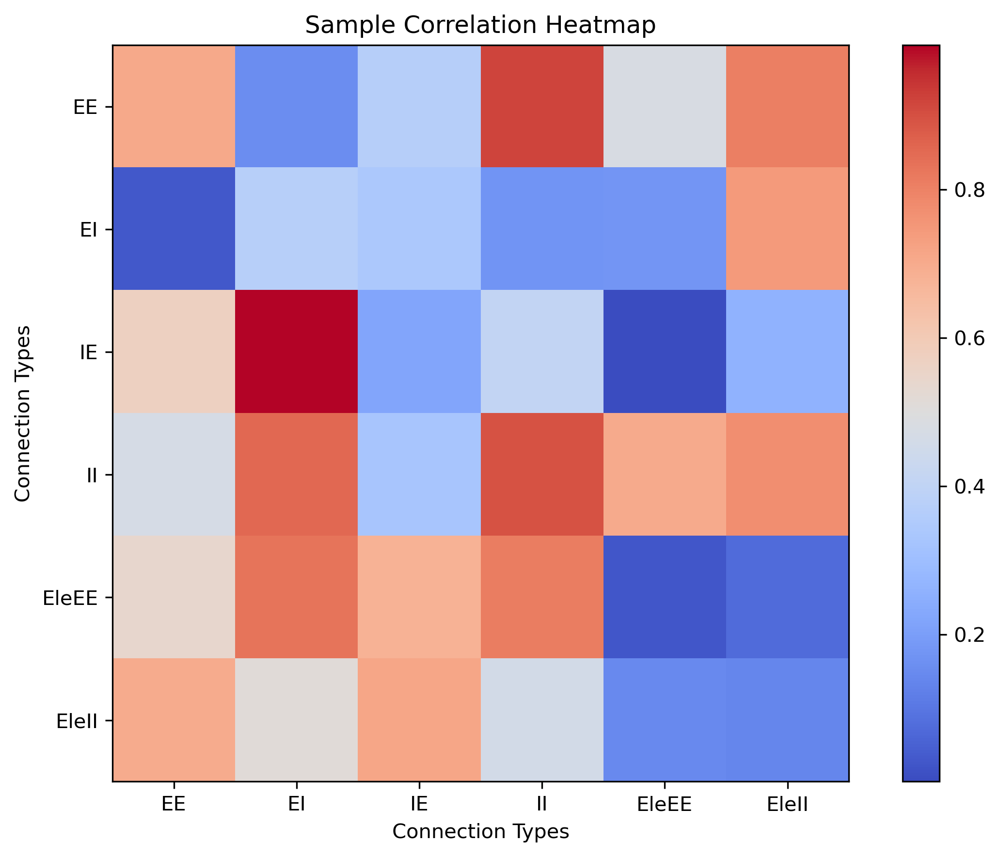
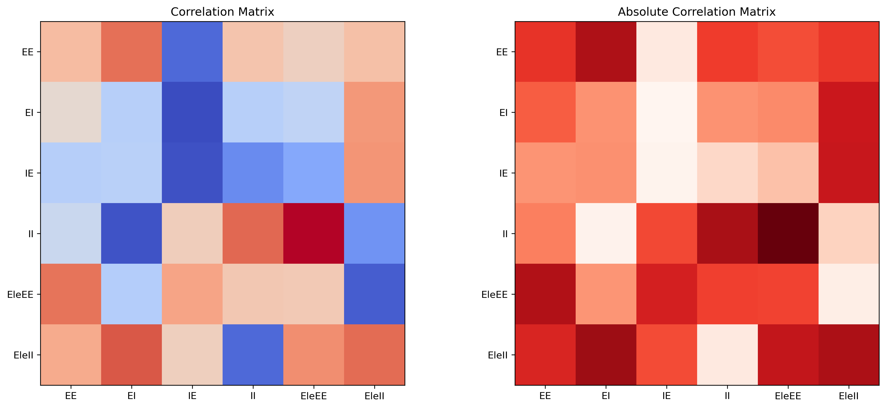
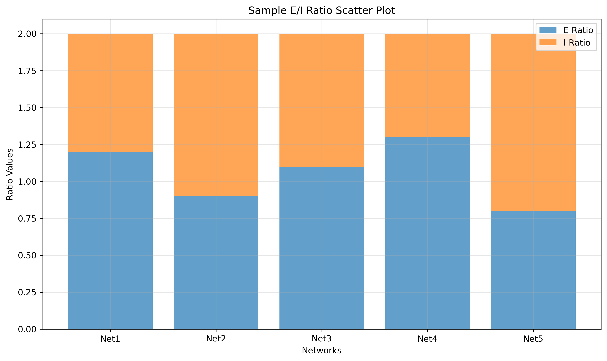

# Network Analysis Package

A comprehensive Python package for analyzing neural network structures and connection ratios, with advanced visualization capabilities.


## Overview

This package provides a robust set of tools for analyzing neural networks, with a focus on:

1. Connection type distributions
2. Correlation analysis between different metrics
3. Excitatory/Inhibitory (E/I) ratio analysis
4. Visualization of network properties
5. Batch processing capabilities

## Author

Hua Cheng <trernghwhuare@aliyun.com>

## Installation

```bash
# Clone the repository
git clone https://github.com/trernghwhuare/network-analysis-workflow.git
cd network-analysis-workflow

# Install dependencies
pip install -r requirements.txt
```

## Quick Start

The easiest way to get started is to run the interactive getting started script:

```bash
python getting_started.py
```

This script will:
1. Check that all prerequisites are met
2. Create sample data for demonstration
3. Run a sample analysis
4. Provide next steps for continued exploration

## Usage

### Main Analysis Tools

The package includes several powerful analysis modules:

1. **Connection Ratio Analysis** - Comprehensive analysis of E/I ratios in neural networks
2. **Standard Analysis** - General network analysis and visualization tools

### Running Connection Ratio Analysis

```python
from network_analysis_package import conn_ratio

# Analyze connection ratios from JSON files
results = conn_ratio.analyze_connection_ratios(
    json_files=['input_data/network_connection_stats.json'],
    plots_dir='output_plots'
)
```

Or run directly as a module:
```bash
python -m network_analysis_package.conn_ratio
```

### Running Standard Analysis

```python
from network_analysis_package import analysis

# Plot connection type violins
analysis.plot_connection_type_violins(dataframe, outpath='output_plots/violins.png')

# Plot clustered heatmap
analysis.plot_clustered_heatmap(dataframe, outpath='output_plots/clustermap.png')

# Plot combined heatmaps
analysis.plot_combined_heatmaps(dataframe, outpath='output_plots/combined.png')

# Plot E/I scatter with stacked bars
analysis.plot_ei_scatter_with_stacked(dataframe, outpath='output_plots/ei_stacked.png')
```

Or run the standard analysis script:
```bash
# Process all datasets in input_data directory
python analysis.py --all

# Process a specific dataset
python analysis.py --basename network_name
```

## Directory Structure

To avoid confusion with directory names, the package uses a clear directory structure:

```
network-analysis-workflow/
├── input_data/             # Input data (JSON files with network statistics)
├── output_plots/           # Output visualizations and plots
├── network_analysis_package/
│   ├── __init__.py
│   ├── conn_ratio.py       # Connection ratio analysis functionality
│   └── analysis.py         # Standard analysis tools
├── example_usage.py        # Example script
├── demo_workflow.py        # Demo workflow
├── requirements.txt        # Dependencies
└── README.md              # Documentation
```

## Sample Results

### Connection Ratio Analysis Plots

Example of a regression plot showing the relationship between overall E/I ratio and correlation:



Example of distribution histograms showing the spread of different ratio types:



### Standard Analysis Plots

Example of connection type violin plots showing distributions of different connection types:



Example of clustered correlation heatmap showing relationships between metrics:



Example of combined heatmaps showing correlation matrices:



Example of E/I ratio scatter plot with stacked bars:



### Generating Sample Plots

To generate sample plots for your own data:

```bash
# Generate sample plots with placeholder data
python create_placeholder_images.py

# Generate sample plots with real data
python generate_sample_plots.py
```

## Package Structure

```
network_analysis_package/
├── __init__.py
├── conn_ratio.py          # Connection ratio analysis functionality
├── analysis.py            # Standard analysis tools
└── ...                    # Other modules
```

## Features

### Connection Ratio Analysis

The connection ratio analysis module provides:

- Overall E/I ratio calculations
- Synaptic E/I ratio calculations
- Electrical E/I ratio calculations
- Scatter plots with regression analysis
- Distribution histograms for different ratio types
- Batch processing of multiple networks
- Detailed statistical analysis

### Standard Analysis Tools

Standard analysis includes:

- Connection type violin plots
- Correlation heatmaps (clustered and combined views)
- E/I scatter plots with stacked bars
- Customizable visualization options
- Batch processing capabilities

## Output

The analysis tools generate several types of publication-quality plots:

1. **Connection Ratio Plots**:
   - `{network}_regression.png` - Scatter plots with regression lines
   - `{network}_ratio_distributions.png` - Histograms of E/I ratios

2. **Standard Analysis Plots**:
   - `{basename}_summary_connection_violins.png` - Violin plots of connection types
   - `{basename}_clustermap.png` - Clustered correlation heatmap
   - `{basename}_combined_heatmaps.png` - Side-by-side correlation heatmaps
   - `{basename}_ei_with_stacked.png` - E/I ratio scatter plots

All plots are saved in the specified output directory with consistent naming conventions.

## Continuous Integration

This repository uses GitHub Actions for continuous integration. The workflow includes:

- Testing package imports
- Running example scripts
- Code linting
- Compatibility testing across multiple Python versions (3.7, 3.8, 3.9, 3.10)


## Requirements

- Python 3.6+
- NumPy
- Pandas
- Matplotlib
- Seaborn
- SciPy
- scikit-learn (for clustering)
- statsmodels (for statistical analysis)

See `requirements.txt` for detailed version information.

## License

This project is licensed under the MIT License - see the LICENSE file for details.

## Documentation

See [ANALYSIS_WORKFLOW.md](ANALYSIS_WORKFLOW.md) for detailed documentation on the analysis workflow, function usage, and the new connection ratio analysis module.